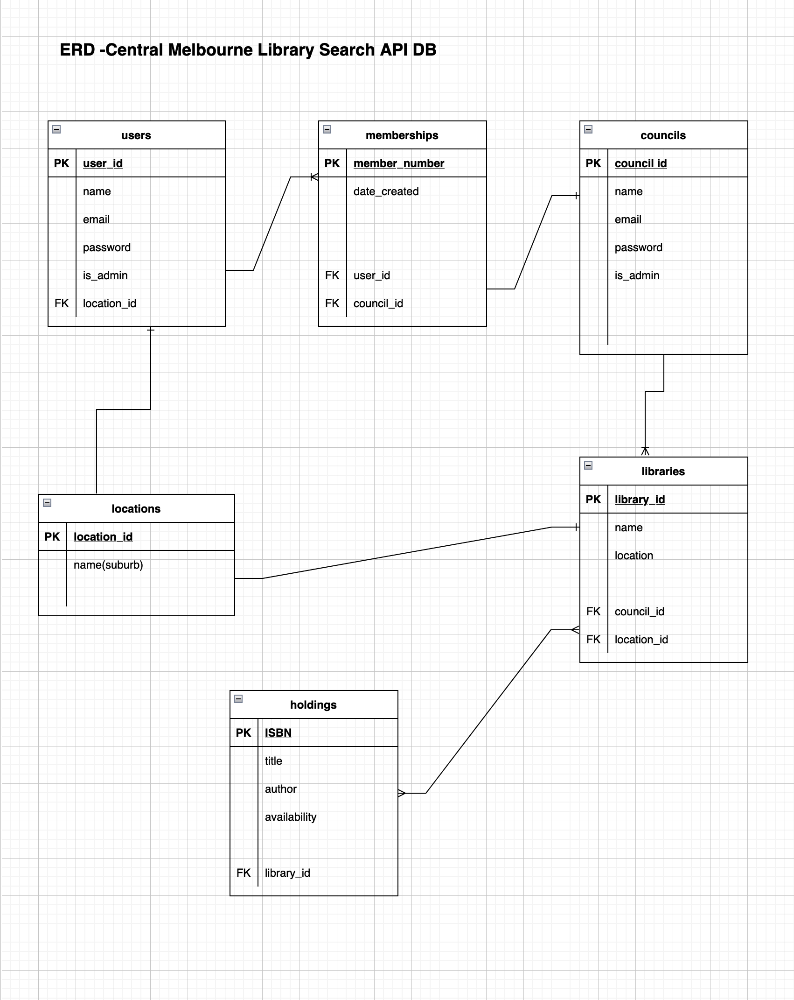
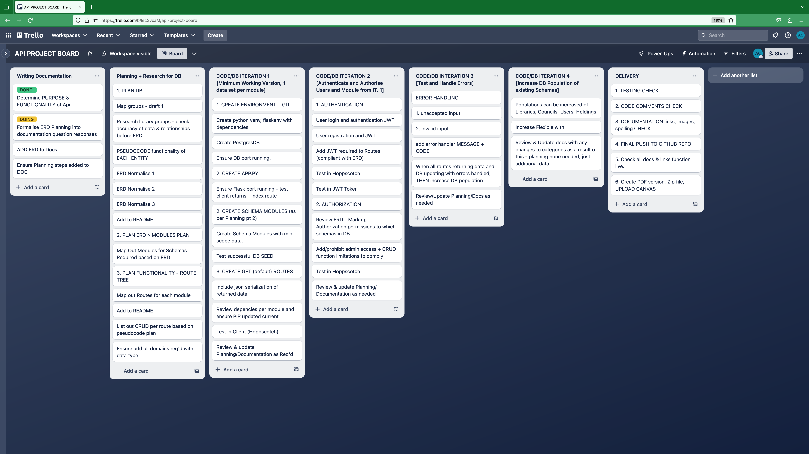
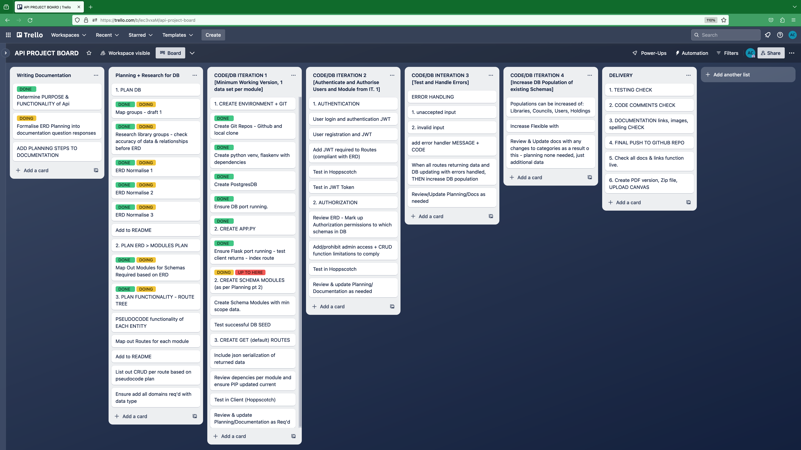
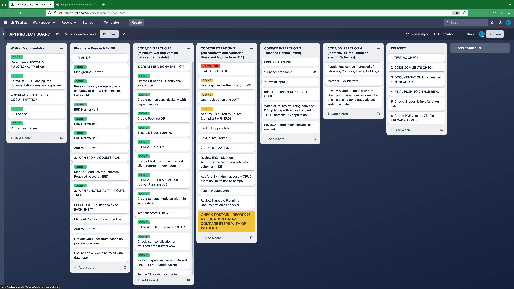
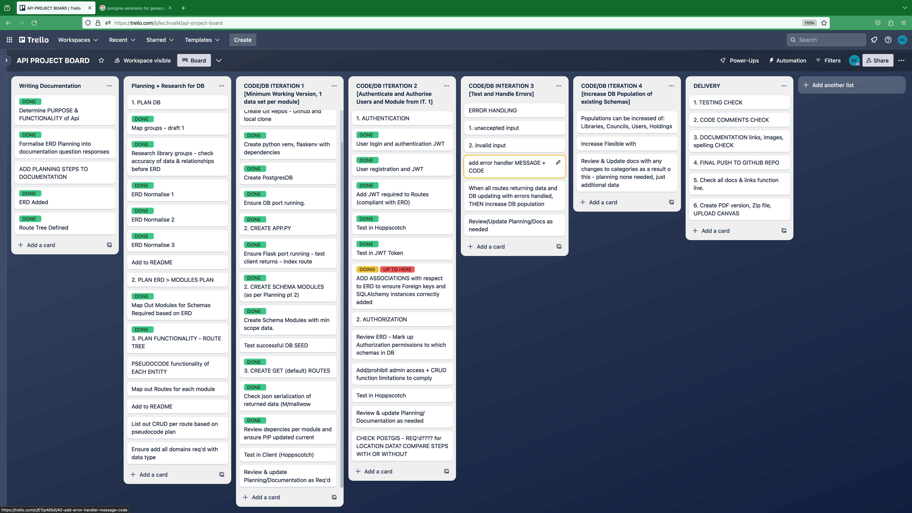
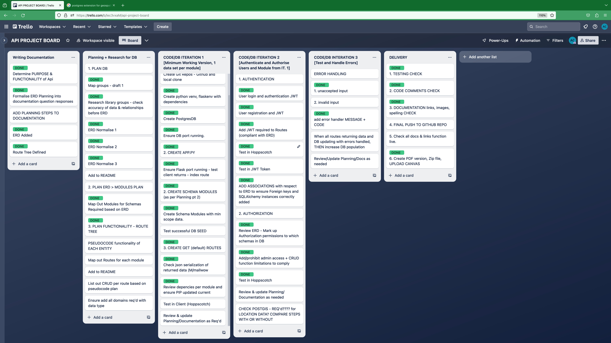

# melbourne-library-search-api

### R1 Identification of the problem you are trying to solve by building this particular app.

Melbourne has a wide range of public library resources to which all Victorian residents have free membership eligibility and access. However, due to the structure of local councils all these resources are siloed into web catalogues that only serve one council at a time. There is not existing web app for a user who is eligible for and may have or may wish to have multiple memberships to find items available to them on one central search platform.
Each council has multiple library branches spread throughout their area. This means that a resident living in one council is likely to have a small library branch close to them. They are also just a likely to live close by to a branch from a neighbouring council as to other branches in their own council area.
This API only attempts to include data from the Inner Northern suburbs.

### R2 Why is it a problem that needs solving?

The lack of a central search problem means that residents are unaware of the resources around them, or may have trouble finding them. To find a resource a resident would have to research the names of the councils in Melbourne, and search all catalogues independently to find a resource. It’s possible, but it’s preventatively complicated.

### R3 Why have you chosen this database system. What are the drawbacks compared to others?

Because the API idea relates to institutions in the public sector, Postgresql is a suitable DBMS to choose. It’s open source which helps keep DBMS costs low, meaning that should the idea be funded, resources could be spent on expanding the database, and funding its management. Postgresql is also a long standing DBMS, making it a more appealing investment for the public sector, where fund raising may be less agile and reluctant to catch or invest in DBMS that are more niche and transitory. Finally, Postgresql also has extensions like Postgis for using geospatial data that would make it suitable for mapping locations in the greater Melbourne area and give users feedback as to how far available resources are to them.

Postgresql’s disadvantages is that it can run slower than other more streamline DBMS that make use of data held in memory more efficiently like MariaDB. The benefit of the extensions can also be a drawback, where there may be a higher risk of bugs with more elements needing to work together seamlessly. It would also require a back end web team with good knowledge of not just postgres but also the extensions to maximise the capability of the management system.

### R4 Identify and discuss the key functionalities and benefits of an ORM

Key Function:

An ORM, in this case SQLAlchemy allows the API to be written in a high level programming language, like Python, while querying a database with SQL within app  framework of Flask. It enables the programmers to get the benefit of creating modules and classes to modularise the code that they would get from any python program, while integrating the commands of SQL to access and alter data in the database. Because it also hooks into the Flask app framework it means that incoming data from the client can be parsed also.

Key benefit:

The modularisation and use of classes etc, means less information needs to be hard-coded and allows incoming dynamic data to be posted or to update the database.
Modularisation makes the program more easily expanded, as classes and modules can be added and integrated more easily. It supports unit testing and debugging. 
Finally, it provides structure which increases security by allowing the programmers to allow and deny access to whole functions of the api or schemas of data according to user privileges.

### R5 Document all endpoints for your API

- '/users/register' (OPTIONS, POST)
- '/users/login' (OPTIONS, POST)
- '/users/' (HEAD, OPTIONS, GET)
- '/councils/register' (OPTIONS, POST) 
- '/councils/login' (OPTIONS, POST)
- '/councils/' (HEAD, OPTIONS, GET)
- '/memberships/all' (HEAD, OPTIONS, GET) 
- '/memberships/update/<id>' (OPTIONS, PATCH, PUT)
- '/memberships/delete/<id>' (DELETE, OPTIONS)
- '/libraries/' (HEAD, OPTIONS, GET) -
- ‘/holdings/title/<id>’ (HEAD, OPTIONS, POST, GET)
- ‘/holdings/author/<id>' (HEAD, OPTIONS, POST, GET)

### R6 An ERD for your app

### R7 Detail any third party services that your app will use (packages)

Marshmallow - serialise data incoming and outgoing to json output
JWT - Json Web Token to encrypt and create session login token - authenticate user login.
BCrypt -for generating user password hash encryption.

### R8 Describe your projects models in terms of the relationships they have with each other

users - defines the users of the api, allows them to log in
councils - defines councils as a separate category of user. councils also give memberships and run libraries.
libraries - lists all the library locations for the councils in the region.
memberships - lists a users existing memberships 
locations - lists the relevant locations

### R9 Discuss the database relations to be implemented in your application

- Users > memberships is a one to many relation where one user can have multiple memberships.
- Memberships > councils is a one to one relation where each council can only generate one membership per user
- Libraries > councils is a one to many relation where councils have multiple library branches
- libraries > holdings is a many to many relation where one library branch will have multiple holdings and one holding may exist as multiple copies across multiple branches.
 -locations>libraries is a one to one relation with each library existing at one location (no mobile libraries)
- location>users is a one to one relation with each user residing at one location at a time

### R10 Describe the way tasks are allocated and tracked in your project

I used a Trello board to map the steps of the project. I tried to map out all the steps of the task beforehand - that I could foresee. Then I went through each step using DOING or DONE labels to show progress. I used a UP TO HERE marker to know where to recommence my project. I updated the cards on my Trello board as I needed to add or remove steps. 

The approach wasn’t completely inline with an agile framework - it was more like a big scrum sprint with everything mapped , but then more like a Kanban with just a doing, done, to do status for each task and tasks being reviewed as the project progressed.

